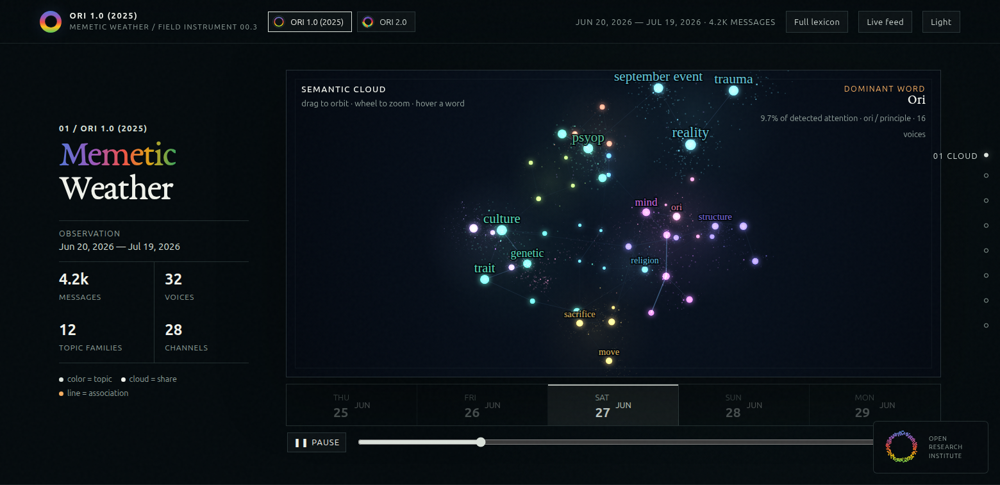
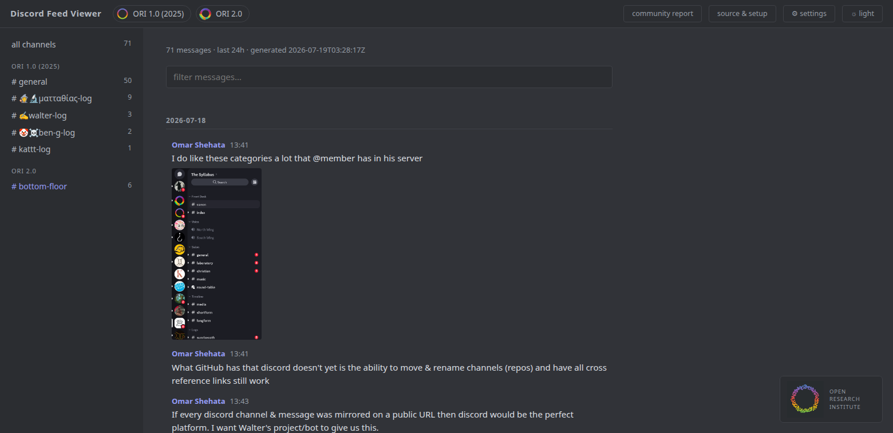
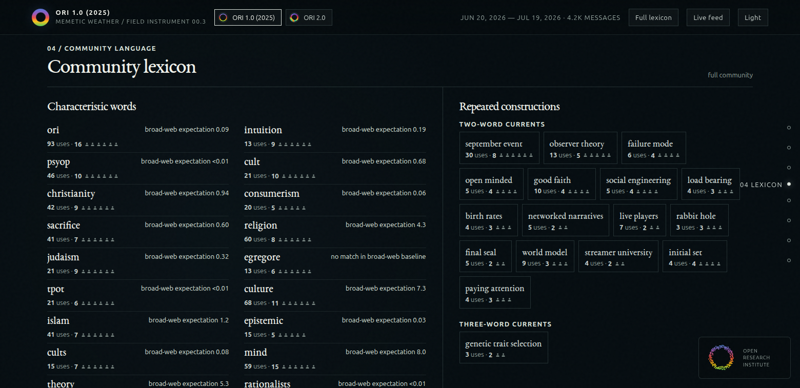

# ORI-feed

<p align="center">
  
</p>
<p align="center"><em>Memetic Weather — the current shape of a community's detected topical language.</em></p>

Get a feel for any Discord server. Add a read-only bot, collect one canonical
event history, and build two views: the rolling raw feed and an attributed,
model-free Community Report.

One bot token drives the whole system. `feed.py` enumerates every server the bot
can access, writes one multi-server history, and the report builder applies the
same language pipeline independently to every server in that history.

Built for the [Open Research Institute](https://openresearchinstitute.org);
works on any server.

## Two views, one history

<table>
  <tr>
    <th>Live feed</th>
    <th>Community report</th>
  </tr>
  <tr>
    <td></td>
    <td></td>
  </tr>
  <tr>
    <td>Readable messages, channels, threads, replies, and durable media.</td>
    <td>Topics, movement, lexicon, conversation circles, activity, and sources.</td>
  </tr>
</table>

## Quick start

**1. Get the code**

Click the green *Code* button → *Download ZIP* (or `git clone`), unzip anywhere.
You need Python 3 — nothing else, no packages to install.

**2. Add the existing Zero bot, or make your own**

For a server administrator testing with ORI, use this invite:

**[Invite Zero to a Discord server](https://discord.com/oauth2/authorize?client_id=1524577359099854999&scope=bot&permissions=66560)**

The invite requests only **View Channels** and **Read Message History**. The
administrator chooses the observable boundary through Discord's normal role
and channel permissions. Zero cannot see a channel its role cannot see.

To use your own Discord application instead:

1. Go to the [Discord developer portal](https://discord.com/developers/applications) → *New Application* → name it.
2. Open the **Bot** tab → enable **Message Content Intent** → *Save*.
3. Same tab → *Reset Token* → **copy the token** (this is the bot's password — keep it private).
4. Invite it to your server by opening this URL, with `YOUR_APP_ID` replaced by
   the *Application ID* from the *General Information* tab:

   ```
   https://discord.com/oauth2/authorize?client_id=YOUR_APP_ID&scope=bot&permissions=66560
   ```

   `66560` = View Channels + Read Message History. Read-only — the bot can't
   post or manage anything.

**3. Hook the bot to the tool**

The token from step 2 is the only wiring there is. Two ways to connect it:

- **Locally:** `python3 feed.py --setup` — paste the token when asked; it's saved
  to `token.txt` (git-ignored, file mode 600) and used automatically from then on.
  One-off alternative: `DISCORD_TOKEN=… python3 feed.py`.
- **On GitHub (hosted):** add the token as an Actions secret named
  `DISCORD_TOKEN` (see *Keeping it updated* below). Never commit the token itself.

The bot reads every channel its roles allow. If your server has
permission-restricted channels that *should* be in the feed, give the bot (or a
role it holds) *View Channel* + *Read Message History* on them — whatever it
can't read is skipped automatically and counted in
`channels_skipped_no_access`.

**4. Run it**

```
python3 feed.py --setup     # first time: token + preferences
python3 feed.py             # pulls the messages
```

For a one-time full-history backfill of every server the bot can access:

```bash
MEDIA=0 python3 feed.py --all-history
```

Backfill records merge into `feed/history/`; they do not replace the rolling
`feed/feed.json` view.

The collector includes ordinary channels, active threads, archived public
threads, and archived private threads that Discord makes accessible. Reading
*all* archived private threads requires Discord's **Manage Threads**
permission; without it, collection falls back explicitly to private threads
the bot has joined. The generated feed records which scope was available.

**5. Look at it**

```
python3 -m http.server 8000
```

Open http://localhost:8000 — channels on the left, messages on the right,
images and videos inline.

Build Memetic Weather from the same canonical history:

```bash
python3 ORI-report/build.py
```

Then open http://localhost:8000/ORI-report/.

The builder writes `ORI-report/data/servers.json` plus one
`weather-<server-id>.json` aggregate per server. Those aggregates contain named
participation and compact per-person lexical contributions, but no message
text, Discord user IDs, message IDs, or message URLs. The complete data flow,
file inventory, privacy boundary, and language-processing rationale live in
the canonical [ORI Report specification](ori-report.md).

## Tuning the knobs

Three equivalent ways — pick whichever you like:

- **In the page:** click the ⚙ icon (top of the sidebar), pick your values,
  then *download config.json* into the ORI-feed folder — or copy the shown
  one-line command.
- **The wizard:** `python3 feed.py --setup` asks you everything.
- **By hand:** edit `config.json`.

| Knob | config.json | Default | Meaning |
|---|---|---|---|
| Window | `window_hours` | `24` | How far back to pull (`168` = a week — good for a first feel) |
| Media | `media` | `true` | Download images/videos locally (Discord's own links expire) |
| Media cap | `media_max_mb` | `50` | Skip files bigger than this |
| Snapshots | `snapshot` | `false` | Also keep a dated copy per run, `feed/daily/YYYY-MM-DD.json` |

Environment variables (`WINDOW_HOURS`, `MEDIA`, `MEDIA_MAX_MB`, `SNAPSHOT`)
override `config.json` for one-off runs.

Like `token.txt`, the root `config.json` and any `feed/daily/` snapshots are
deployment-local preferences: both are git-ignored and never pushed.

## Keeping it updated automatically (optional)

**On your own machine** — add one cron line (`crontab -e`), e.g. daily at 07:00
with dated snapshots:

```
0 7 * * * cd /path/to/ORI-feed && SNAPSHOT=1 python3 feed.py >> feed.log 2>&1
```

**Hosted for free on GitHub** — fork this repo, then:
1. Repo *Settings → Secrets and variables → Actions* → add secret
   `DISCORD_TOKEN` = your bot token.
2. *Settings → Pages* → deploy from branch `main`, folder `/`.
3. Done. The included workflow (`.github/workflows/feed.yml`) pulls daily.
   GitHub Pages is a **public deployment**, including `feed/feed.json`; enable it
   only when that matches the server's data policy. A private/local deployment
   can use the same collector and report without publishing either one.

## The data format

One JSON object per message, flat list, sorted by time — designed so exports
from other platforms (Twitter, Slack, Signal…) can merge into the same stream:

```json
{
  "user": "Defender",
  "message": "the text content",
  "timestamp": "2026-07-10T13:48:23.433+00:00",
  "channel": "general",
  "channel_id": "discord:1344305064818249788",
  "thread": null,
  "thread_id": null,
  "reply_to": null,
  "id": "discord:1344305064818249788",
  "user_id": "discord:1221182134950301706",
  "url": "https://discord.com/channels/…",
  "attachments": [{"name": "image.png", "url": "…cdn link…",
                   "file": "feed/media/…", "bytes": 54241}],
  "platform": "discord",
  "server": "ORI 1.0 (2025)",
  "server_id": "discord:1344300408893345863"
}
```

Message, user, server, channel, and thread IDs are platform-prefixed
(collision-free merging). `url` is the
permalink to the original message (provenance), `attachments[].file` is the
local copy (survives Discord's expiring CDN links). Wrapper fields include
`generated`, `window_hours`, `message_count`, and collection coverage. Each run
also merges records into monthly `feed/history/YYYY-MM.jsonl` partitions;
repeated pulls update the same message ID instead of duplicating it.
High-confidence API credential formats are replaced with
`[credential redacted]` before either public file is written.

## Privacy / consent

Privacy and retention are deployment policy, decided with each participating
server. Discord channel permissions define what the collector can observe:
deny the bot a channel and that channel never enters the feed. This ORI
deployment retains canonical raw history and produces an attributed report;
that decision must be made before running the collector for another server.
The report includes display names and aggregate counts, but no message text,
direct participant IDs, message IDs, or message URLs.
