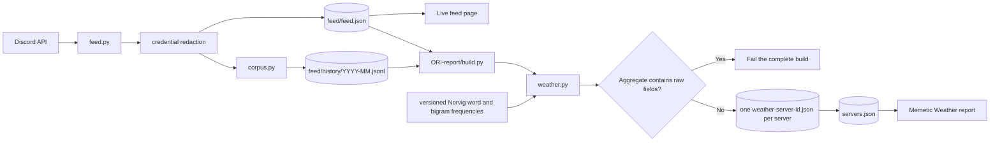

# ORI Report — canonical data and language specification

This is the canonical technical document for ORI Feed and Memetic Weather. It
describes the active files, the complete data path, and the language decisions
that determine what appears in the report.

## Product model

There is one bot, one collector, and one canonical multi-server history. The
live feed and the report are two projections of those same observations.



`feed.py` automatically enumerates every server the bot belongs to. It does
not need a second collector or a per-server report mode. `build.py` groups the
canonical history by `server_id` and runs the same reducer for every group.
`ORI-report/config.json`'s `guild_id` determines which server is listed first;
it does not change the analysis or filename contract.

Every server report is named `weather-<server-id>.json` and is indexed by
`ORI-report/data/servers.json`. The browser has no alternate single-report
fallback. If any populated server cannot be reduced or violates the output
boundary, the multi-server build fails visibly instead of silently publishing
a partial result.

## Running it

From the repository root:

```bash
python3 feed.py --setup       # first run: save token and feed preferences
python3 feed.py               # update live feed and canonical history
python3 ORI-report/build.py   # rebuild every server report
python3 -m http.server 8000
```

Open:

- live feed: <http://localhost:8000/>
- Memetic Weather: <http://localhost:8000/ORI-report/>

For a one-time complete backfill of every accessible server:

```bash
MEDIA=0 python3 feed.py --all-history
python3 ORI-report/build.py
```

The daily GitHub workflow performs the same two production operations in the
same order: run `feed.py`, then run `ORI-report/build.py`.

The broad-English word and bigram tables are versioned under
`ORI-report/data/reference/` and verified by SHA-256 before analysis. The
builder fails rather than treating a missing or malformed baseline as evidence
that every observed word is locally distinctive.

## Durable data

### Rolling feed

`feed/feed.json` contains the most recent configured window from every server,
plus server names, icons, current member-alias tokens, and collection coverage.
It drives the root feed page and supplies current roster/coverage metadata to
the report builder.

### Canonical history

`feed/history/YYYY-MM.jsonl` is the source of historical truth. Each line is a
normalized Discord message. `corpus.py` partitions by UTC month and replaces a
record with the same platform-prefixed message ID, so repeated pulls can update
reactions or attachments without duplicating the message.

The canonical record includes message text and identity. At collection time,
Discord user-mention IDs are joined with the display names included in the
same API message, so the stored feed reads `@Name` as Discord does. Recognizable
API credentials are then replaced with `[credential redacted]` before either
the rolling feed or canonical history is written. Other message text remains
literal.

| Field | Meaning |
|---|---|
| `id` | Platform-prefixed message ID and deduplication key |
| `server_id`, `channel_id`, `thread_id`, `user_id` | Stable origin identities |
| `server`, `channel`, `thread`, `user` | Human-readable origin and author |
| `message` | Observed message text with user mentions resolved and credentials redacted |
| `timestamp` | Original timestamp |
| `reply_to`, `url` | Provenance and relationship |
| `attachments`, `reactions` | Attachment metadata and reaction totals |
| `is_bot`, `type` | Eligibility metadata |

### Report aggregates

`ORI-report/data/weather-<server-id>.json` contains display names and aggregate
participation because this ORI deployment requests attributed analysis. It
does not contain message text, Discord user IDs, message IDs, message URLs,
reply IDs, or attachment records. `build.py` recursively validates this
boundary before any server outputs are written.

## Analysis windows

One stored history produces every window; no feature recollects Discord.

| View | Window |
|---|---:|
| Live feed | Most recent 24 hours by default |
| Memetic Weather and topic share | Most recent 30 calendar days |
| Lexicon and repeated constructions | Most recent 30 calendar days |
| Conversation circles, people, heartbeat, sources, and symbols | Most recent 30 calendar days |
| Language movement | Most recent 13 complete weeks versus the preceding 13 |

Each server's current window ends at its own latest stored human message. A
young server can therefore produce current weather before it has enough history
for the movement comparison; that panel reports `needs_more_history`.

## Language processing

### 1. Eligibility and tokenization

The reducer accepts human default messages and replies with valid timestamps.
Bot messages and unsupported Discord event types do not enter language counts.

Words are lowercase observed surfaces matched by:

```text
[a-z][a-z'\-]{2,}
```

URLs and Discord markup are removed first. Phrase boundaries cannot cross
punctuation, URLs, Discord markup, or newlines: deleting a period must never
manufacture a bigram across two sentences.

The analyzer does not silently stem or rewrite observed vocabulary. A
conservative plural fold exists only inside topic clustering, and only when the
candidate singular form was itself observed.

The following cannot become published language features:

- English stopwords;
- Discord and general platform vocabulary;
- current member aliases, collected to prevent names from becoming keywords;
- conversational scaffolding such as generic agreement and turn-taking words;
- explicit review exclusions from `ORI-report/config.json`.

The explicit exclusion list currently contains `lol` and `lmao`. This list is
the inspectable human-review layer for language that a general statistical rule
cannot classify according to the product's purpose.

### 2. Characteristic vocabulary

Single-word rates are compared with Peter Norvig's Google Web Trillion Word
frequency list. A word enters the characteristic inventory when it has:

- at least 5 uses;
- at least 2 distinct voices;
- at least 3 times its broad-web rate, or no match in the finite reference.

No baseline match is reported exactly that way. It does not mean “outside
English,” and it does not become an infinite numeric ratio.

Eligible words are ranked with both adoption and distinctiveness:

```text
rank = log(1 + uses)
     × log(1 + distinct voices)
     × log2(min(local rate / broad-web rate, 100))
```

The 100-times ceiling is intentional. Above two orders of magnitude, the exact
ratio mostly describes the tail or coverage of the reference corpus. All such
terms receive the same maximum distinctiveness credit, after which actual uses
and voice breadth decide their order. A term with no reference match receives
that same saturated credit.

The page translates the comparison into expected uses in an equal-sized
broad-web sample. For example, `ori` can show 93 observed uses and a broad-web
expectation of 0.09. The two visual columns form one continuous ranked list;
they are layout columns, not separate linguistic categories.

### 3. Repeated constructions

Bigrams and trigrams are literal adjacent constructions rather than generated
labels. Every candidate needs:

- at least 3 observed uses;
- at least 2 distinct voices;
- positive normalized pointwise mutual information;
- content-bearing language rather than only stopwords or scaffolding.

A bigram also needs at least 10 times its broad-English whole-phrase rate, or
no match in the bigram reference. Comparing the whole construction preserves a
local phrase made of ordinary words—such as `september event`—while removing a
common frame such as `long time`.

The bundled reference has no comparable trigram table. A trigram therefore
needs at least two component terms that independently pass the topic-bearing
gate. This keeps constructions such as `genetic trait selection` without
pretending to know their general-English trigram rate.

### 4. Topics and Memetic Weather

Topics answer a narrower question than the construction table: what occupies
the community's detected topical language?

A word may become a weather unit when it has at least 5 uses, 2 voices, no more
than 150 broad-web occurrences per million words, and at least 3 times its
broad rate—or no reference match. A bigram must first pass the construction
rules, then have at least 5 uses, 3 voices, and observations on 2 dates.

After phrase discovery, the reducer replays the current window with qualified
bigrams as atomic units. A matched `observer theory` claims those two token
positions. That occurrence is not simultaneously counted as `observer`,
`theory`, and `observer theory`; component words remain evidence only where
they were used independently.

Atomic units are connected through two kinds of observed relation:

- a composition relationship between a qualified phrase and an independently
  qualified component;
- repeated proximity within an eight-token message neighborhood.

Observed-context edges need at least 2 message documents and normalized
association of at least 0.12. Only each unit's strongest seven edges survive.
Deterministic weighted modularity partitions that graph into topic families.

The 3D cloud renders those same units and edges. Bigrams are therefore real
nodes, not labels painted over a separate word-only model. When a phrase and a
component belong to the same family, the phrase owns the visible label while
the component can still contribute particles and counts.

Daily semantic-unit rates are causally smoothed with the current day and two
prior days, then normalized to 100% of detected topical language. Particle
volume and the topic graph show composition, while message volume remains a
separate statistic.

### 5. Language movement

Movement deliberately uses a broader word-and-phrase inventory than the topic
gate. It compares normalized rates over the most recent 13 complete weeks with
the preceding 13 weeks.

The page displays plain percentage change, `new` when the prior window has no
uses, and `not seen recently` when the current window has none. A smoothed
log-ratio remains internal only for ordering:

```text
internal rank = log2(
  ((recent uses + 0.5) / (recent words + 1000))
  /
  ((previous uses + 0.5) / (previous words + 1000))
)
```

The pseudocounts prevent division by zero. The value is not serialized or
shown as “bits,” because it is useful mathematics but poor viewer language.

### 6. Conversation circles and origin channels

Conversation circles are detected from participant-by-channel activity, not
from word similarity. Two people are connected when they repeatedly inhabit
the same channels. Broad rooms are down-weighted so `#general` does not erase
smaller neighborhoods; weighted modularity finds the groups.

Only after membership is fixed do qualifying topics and vocabulary describe a
circle. A small group cannot reintroduce generic words rejected by the global
language gates. The adjacent origin-channel view reverses the question and
shows who and what are concentrated in each channel.

### 7. Subtracting a voice

The aggregate stores compact per-person word and phrase contributions. The
browser can subtract selected people from the visible lexicon and recompute
uses, voice breadth, broad-web expectation, eligibility, and rank.

Topic clustering is not rerun in the browser. The control is therefore named
and documented as a lexicon lens, not presented as a complete alternate report.

## Active files

| File | Responsibility |
|---|---|
| `feed.py` | The only Discord collector; reads every accessible server, channel, and thread. |
| `corpus.py` | Canonical monthly JSONL merge, deduplication, and iteration. |
| `index.html`, `logo.js`, `assets/gradient-circle.png` | Live multi-server feed page and shared ORI badge. |
| `assets/memetic-weather.png`, `assets/ori-feed.png`, `assets/community-report.png` | Screenshots rendered from the local application for the repository README. |
| `feed/feed.json` | Generated rolling feed and current server metadata. |
| `feed/history/` | Raw canonical multi-server history. |
| `feed/media/`, `feed/daily/` | Optional durable attachments and snapshots. |
| `ORI-report/build.py` | Groups canonical history by server, reduces all servers, validates, and writes the report index. |
| `ORI-report/weather.py` | Tokenization, lexicon, phrases, topics, movement, circles, people, sources, symbols, and activity. |
| `ORI-report/config.json` | Inspectable analysis thresholds and first-server preference. |
| `ORI-report/index.html` | Page skeleton, theme bootstrap, and report-to-feed navigation. |
| `ORI-report/report.css` | All report styling: themes, the chapter deck, and the responsive passes. |
| `ORI-report/report.js` | Multi-server report loader and slideshow controller. |
| `ORI-report/memetic-weather.js` | 3D semantic graph and particle-cloud renderer. |
| `ORI-report/topic-timeline.js` | Interactive normalized topic timeline. |
| `ORI-report/data/servers.json` | Generated server-to-report index. |
| `ORI-report/data/weather-*.json` | Generated attributed aggregates, one identical schema per server. |
| `ORI-report/data/reference/` | Versioned and integrity-checked broad-English word and bigram frequencies. |
| `.github/workflows/feed.yml` | Daily collector → report builder → commit sequence. |
| `tests/`, `ORI-report/tests/` | Collector, corpus, privacy, and language invariants. |

## Verification

Run before publishing:

```bash
python3 -m unittest discover -s tests -v
python3 -m unittest discover -s ORI-report/tests -v
node --check logo.js
node --check ORI-report/report.js
node --check ORI-report/memetic-weather.js
node --check ORI-report/topic-timeline.js
python3 ORI-report/build.py
```

The build is complete only when every populated server in canonical history is
present in `servers.json`, every indexed report exists, and the durable-output
validator has accepted every aggregate.

## Current research boundary

The only external language baseline currently connected is the broad-web word
and bigram frequency reference. Hacker News, curated Substacks, Google Trends,
Twitter/X, and peer-community comparisons require their own collected corpora
and provenance before they can truthfully become report comparisons.

Raw history publication remains a deployment decision for each participating
server. The current GitHub workflow commits `feed/`; a private server must not
reuse that public deployment policy without explicit consent.
